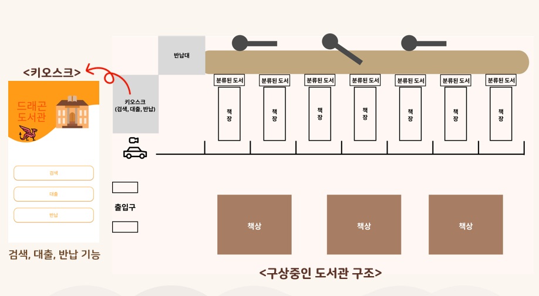
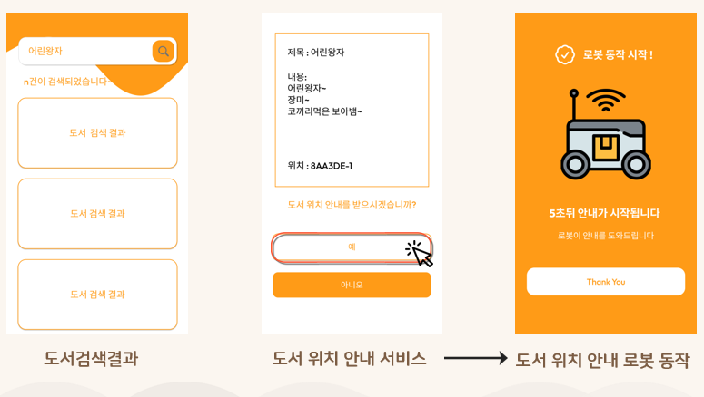
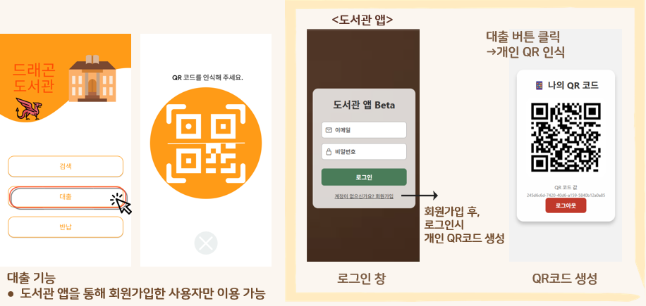
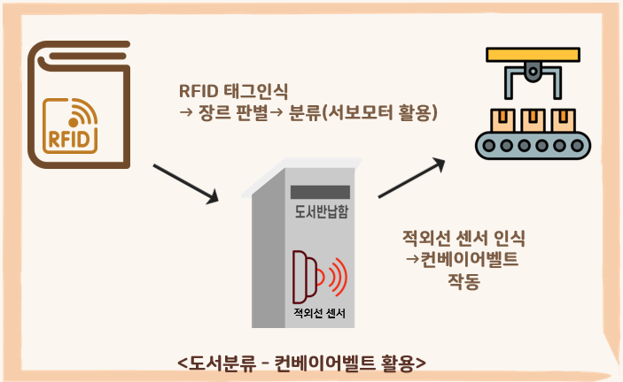
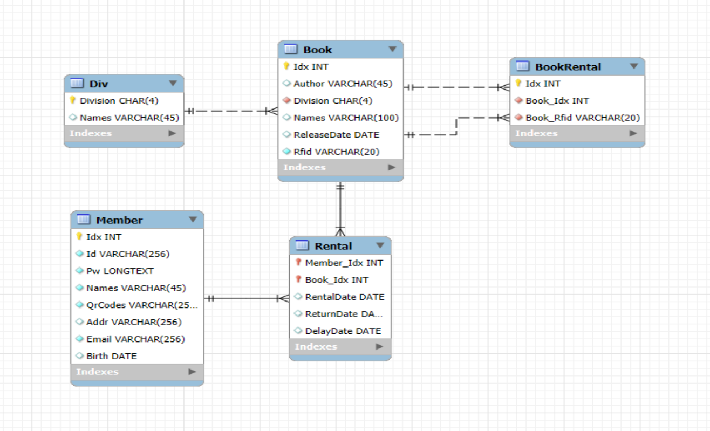

# 2025-IoT-MiniProject
## IoT 팀 프로젝트 [ 프로젝트 명: 스마트 도서관 시스템 (DS.Library)]

---

## 프로젝트 목표
1. **다양한 기술 스택 활용**
    - **프로그래밍 언어**: Python, C/C++, C#
    - **하드웨어**: Raspberry Pi, NodeMCU(ESP8266), ESP32-CAM 기반 로봇카 키트, 서보모터, 적외선 센서, QR 코드 스캐너, RFID 태그 및 리더기, 부저, 컨베이어 벨트, LCD
    - **데이터베이스**: MySQL
2. **실생활 적용 가능성**: 실제 무인 도서관 환경에서 도서 검색, 대출, 반납, 위치 안내, 도난 방지까지 통합된 IoT 시스템 구현

---

## 프로젝트 주제 & 선정 이유
- 이 프로젝트는 도서관 내에서 도서 검색, 대출, 반납, 위치 안내, 도난 방지까지 하나의 통합 시스템으로 구현하는 것을 목표로 한다.
- 도서관은 많은 사람들이 이용하는 공간으로 책을 찾기 어렵거나 반납 과정에서 효율적인 관리가 이루어지지 않고, 대출 기록이 누락되어 도난이 발생하는 등 다양한 문제가 존재한다.
- 이러한 문제를 해결하고 이용자와 관리자에게 보다 편리한 환경을 제공하기 위해 스마트 도서관 시스템을 주제로 선정하였다
- QR 코드 인증, 로봇 안내, RFID 기반 도난 방지, 자동 분류 시스템 등 다양한 IoT 기술을 조합하여 실제 도서관 환경에서도 활용 가능한 지능형 무인 도서관을 구현하고자 한다.

---

## 프로젝트 개요
1. 키오스크에서 도서 검색, 대출, 반납 진행
2. 로봇카를 활용한 라인트레이싱 기반 도서위치 안내
3. 전용 앱을 통한 회원가입 및 QR 코드 인증
4. 반납 시 컨베이어 벨트 + RFID 센서를 통한 자동 장르 분류
5. RFID 기반의 도난 방지 시스템 구현
6. 모든 데이터는 DB와 연동되어 관리

  

---

### 활용 센서 및 부품
- Raspberry Pi
- NodeMCU(ESP8266)
- ESP32-CAM 기반 로봇카
- QR 코드 스캐너
- RFID 태그 및 리더기
- 적외선 센서
- 서보모터
- 컨베이어 벨트
- 부저
- LCD

---

### 핵심 기능
#### 1. 도서 검색
- 키오스크에서 검색 기능 제공
- 검색 결과 확인 후, 위치 안내 로봇 호출 가능
- 로봇카는 라인트레이싱 기반으로 선을 따라 도서 위치까지 안내

  

#### 2. 도서 대출
- 전용 앱 회원가입 -> 로그인 후 개인 QR 코드 발급
- QR 인증 후 도서 대출 가능
- 연체 도서가 있거나 5권 이상 대출 시 이용 제한

  

#### 3. 도서 반납 & 자동 분류
- 반납 시 키오스크 화면 안내
- 적외선 센서에 도서 감지될 때 컨베이어 벨트 작동
- RFID 태그 및 리더기를 통해 장르판별 후 서보모터로 도서 분류
- 자동으로 장르별 보관함에 정리

  

#### 4. 도서 도난 방지
- 출입구 RFID 리더기 설치
- 대출되지 않은 도서가 감지되면 경보음 발생

---

### 데이터베이스 구조
- DB는 도서 정보, 사용자 정보, 대출/반납 기록, RFID 태그 데이터를 중심으로 설계
- 키오스크 및 앱, 센서 모듈과 연동되어 동작

  

---

## 문제 해결
- 추후 작성
